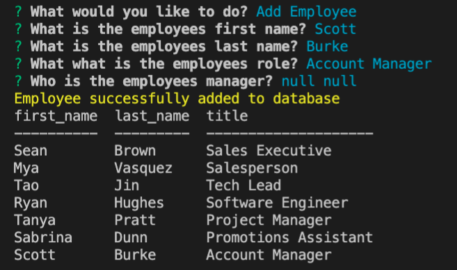

# Welcome to the Employee Tracker App!

## Table of Contents

- [Installation](#installation)

- [License](#license)

- [Contact](#contact)

## Description?

An awesome CLI application to keep track of your employees, and update the corresponding database information.

## What Problem does it Solve?

Allows employers the ability to centralize team member data and keep track of changes.

## Installation

### How to Use?

Simply Open server.js

```bash
npm start
```
& Follow the Prompts

## Go Check us out

## Demo Image: 


### Demo Link:

# [Employee Tracker Demo](https://drive.google.com/file/d/1ws7rOwqFl18QLitTsxxmpzUIsrBXgwD0/view)

## License

[](https://opensource.org/licenses/ISC)

## Contact

### Email

[Contact Email](mailto:create.jasminedaniels@gmail.com)

### Github

[Github](https://github.com/JasmineDaniels)